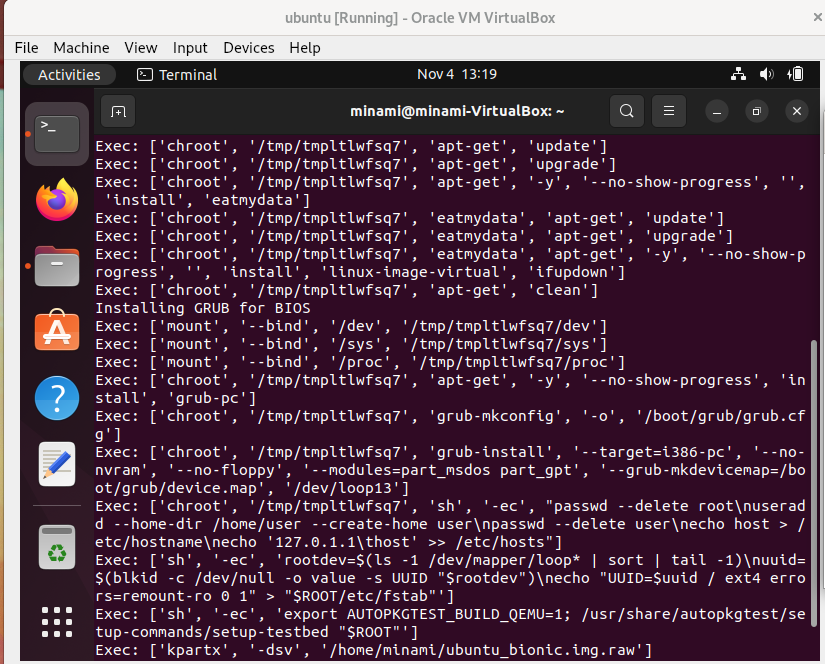
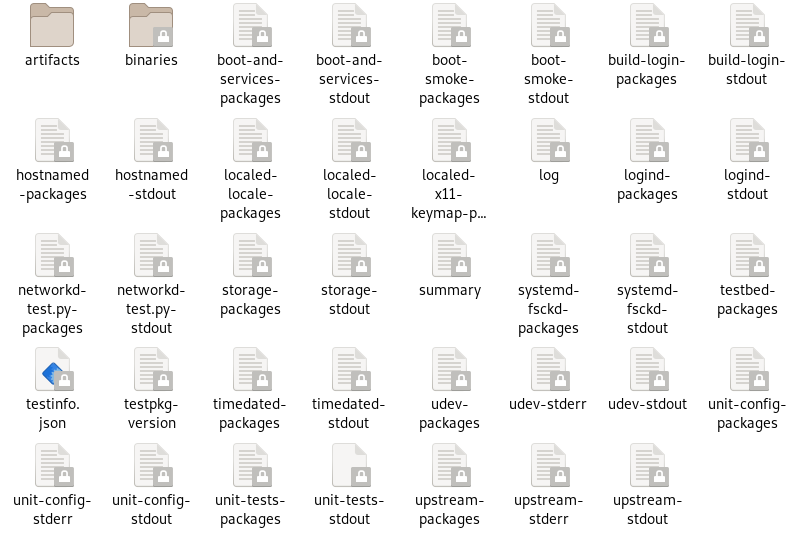
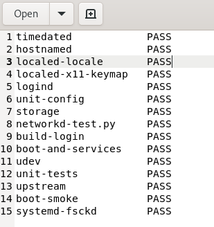
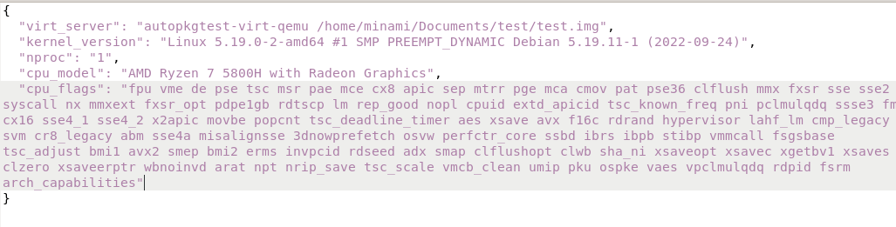
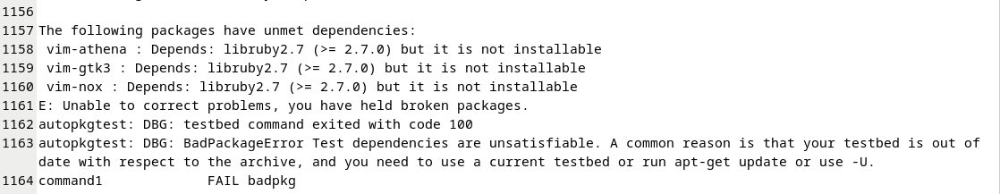
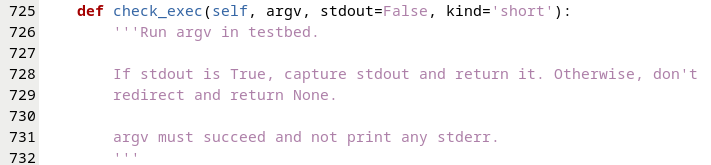
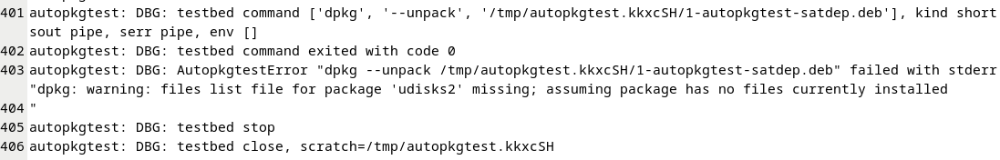
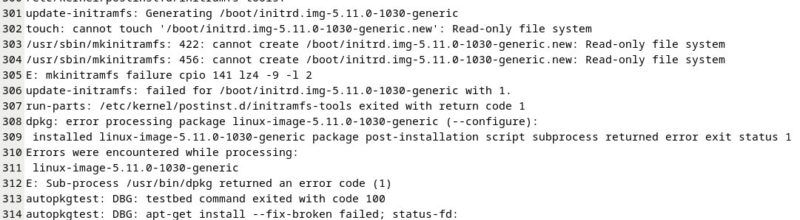

# debian-autopkgtest

这是在对debian的autopkgtest进行调研使用后存放报告的仓库

目录：
 - [事先准备testbed](#1)
 - [autopkgtest的使用](#2)
 - [其在deepin-riscv系统上的测试及跨系统测试遇到的难题](#3)
 - [后续测试的使用（2023-2-10添加）](#4)


## <h2 id="1">testbed的制作及使用</h2>

为了对本机系统进行保护，autopkgtest在运行时需要一个与本机系统相隔离的测试环境，称为`testbed`。

而testbed由于实现方式不同，都有相应的构建方式，以下列出并分析常用的testbed实现方法：
### null
autopkgtest实际上支持直接在本地文件系统内无隔离的进行测试，虽然官方并不推荐，因为测试时可能损坏本地文件，但这种方式无需testbed的创建，只需直接运行即可，如：
```
sudo autopkgtest --apt-upgrade tkcalendar_1.6.1-1.dsc -- null
```
缺点：
 - 首先，由于只是在本地编译运行，可能对本地文件系统造成损伤; 
 - 其次，他也不能实现跨架构的进行测试;
 - 再有，有些测试例需要多设备或者恢复重启功能， 单单在本地运行是无法满足测试例需求的，所以会被SKIP

### chroot 
chroot基本上是计算机上的一个特殊目录，它阻止应用程序（如果从该目录内部运行）访问目录外的文件，chroot就像在现有操作系统中安装另一个操作系统。从技术上讲，chroot会暂时将根目录（通常为/）更改为chroot目录（例如/var/chroot）。由于根目录是文件系统层次结构的顶层，因此应用程序无法访问根目录以外目录，使得应用程序与系统的其余部分隔离，这可以防止chroot中的应用程序干扰计算机上其他位置的文件。

对于debian原生系统以及ubuntu,可使用debootstrap或mmdebstrap构建一个轻量化的debian文件系统作为testbed，详见debian官网，此处给出例子：
```
debootstrap stable /stable-chroot http://deb.debian.org/debian/
```

### schroot -- mk-sbuild

schroot使得用户可以在不同的chroot下执行交互命令，chroot只能被root用户使用，schroot可以被普通用户使用，schroot 在chroot的基础上还提供了permissions checking, environmental setup（如filesystem mount等，在autopkgtest-virt-schroot中，debian官方推荐使用mk-sbuild进行testbed的制作，而这也恰好可以制作出适合普通用户交叉编译的系统

### lxc -- autopkgtest-build-lxc

autopkgtest同样支持容器，其中使用最多的就是lxc,针对这种形式autopkgtest自行配置了一个软件包来对testbed进行构建或进行软件升级,称为autopkgtest-build-lxc，其具体使用本人并没有深入研究，只是贴出debian本地的例子
```
autopkgtest-build-lxc debian sid
```

### qemu -- autopkgtest-build-qemu

autopkgtest也支持使用qemu作为testbed,其中他使用autopkgtest-build-qemu软件包来进行构建，其又使用了vmdb2来构建qemu的img硬盘，由于目前riscv64的测试多使用qemu,下面详细剖析下其img的构建，以便以后的测试参考：
 - 创建硬盘镜像img,格式为raw,并挂载在tmp的某个新建目录（目录名随机生成）
 - 使用debootstrap在挂载的镜像中创建debian文件系统（其中会根据架构确定dpkg的架构，根据镜像的下载仓库以及版本确定下载的版本）
 - 使用chroot在镜像中进行软件的下载（软件源默认根据镜像源配置，并且只有 main 软件仓库，必装软件有ifupdown,linux-image-virt，grub-pc）
 - 使用grub进行开机的引导。
 - 对root,user进行设置（删除其密码）
 - 配置其host网络
 - 对磁盘进行uuid进行设置
 - 运行本地的autopkgtest的setup-command（其中包含一些优化，以及实现运行时设置的参数的功能之类）\
 下为ubuntu下构建镜像的日志输出



## <h2 id="2">autopkgtest的使用</h2>
```
$ sudo autopkgtest [options...] [testbinary...] testsrc -- virt-server [virt-server-arg...]
```
其中具体option与args可查看debian官网的 [man](https://manpages.debian.org/testing/autopkgtest/autopkgtest.1.en.html)

其中几个细节：
 - virt-server由一开始创建的testbed所对应，如qemu,lxc,null等
 - “--”之后需要有空格......
 - 如果不用-o选项制定日志输出日期的话，日志将全部输出到terminal中，而不会生成文件

### 结果的查看

下为生成文件后具体文件的概览图：



对于其中的日志文件
 - summary文件中为测试的所有测试例的名称以及其具体结果，如：



 - testinfo.json文件里储存的是执行测试的本地环境信息，包括内核版本，一些硬件信息等，如：



 - testbed-packages罗列了进行测试用到的testbed的软件包安装情况及具体版本，即运行测试的软件环境

 - testpkg-version文件指出了测试包的版本

 - 其余文件遵循`testname-*`的格式，其中testname为所执行的测试例的名字，而*可以为packages,stdout,stderr，分别代表了样例安装测试的包和依赖，测试时的正常标准输出日志以及错误信息日志

 ## <h2 id="3">在deepin上运行其以及跨系统时遇到的难题</h2>

由于autopkgtest为高度集成的软件包，其中有许多函数互相引用且还与其他的软件包相关联（如autopkgtest-build-qemu使用了vmdb2软件包）， 且常用testbed的配置也依赖于debian对远程仓库的相互支持，导致本地的autopkgtest的运行和测试系统的环境结构需要很严谨的配合，从而进行其他debian系系统（如ubuntu,deepin）的测试变得十分困难，不仅testbed的构建困难重重，且运行时同样有许多问题。

而目前deepin-riscv处于开发测试阶段，可供下载的适合qemu进行运行也就一个deepin beige发行版的base file system。之后的启动内核还需自己编译，从而使得测试的不确定性增大了，而由于在本地debain系统运行autopkgtest尚有许多问题，想要运行也就只能在qemu中运行软件包，而在qemu中运行时不可避免的会出现性能损耗的问题，而本来autopkgtest运行时就需连接testbed，在testbed中运行又会造成进一步的性能损耗，从而出现超时的情况，导致测试例的通过率与实际情况有偏差，而autopkgtest的本地模式即null,并不支持备份重启功能，导致有些测试例会被跳过，导致测试例的执行率不高，不能起到全面测试的效果，故目前运行autopkgtest进行测试困难还很多

## <h2 id="4">后续使用</h2>
后续进行进一步调研后，发现对可以启动的qemu镜像，例如openkylin（详见体验教程）或者ubuntukylin（详见t0ki..的教程），只需进行一定的设置便可使用其镜像进行对应测试，下面给出详细操作过程
### 运行环境
本次尝试host机为Debian11，guest镜像使用openkylin，autopkgtest为Debian testing仓库下apt安装的5.28版本
### 具体操作
在进行一系列操作（下载，解压，启动，扩容）后，guest运行本仓库下参考autopkgtest中对qemu testbed的设置脚本后编写的[脚本](./sh/setup_test.sh)，其具体功能如下：
- 对console进行hvc1以及ttyS0的重定向
```
if [ -e /dev/ttyS1 ] || [ -e /dev/hvc1 ]; then
    mkdir -p "/etc/init.d"
    cat <<EOF > "/etc/init.d/autopkgtest"
#!/bin/sh
### BEGIN INIT INFO
# Provides:          autopkgtest
# Required-Start:    \$all
# Required-Stop:
# Default-Start:     2 3 4 5
# Default-Stop:
### END INIT INFO

if [ "\$1" = start ]; then
    for device in ttyS1 hvc1; do
        if [ -e "/dev/\$device" ]; then
            echo "Starting root shell on \$device for autopkgtest"
            (setsid sh <"/dev/\$device" >"/dev/\$device" 2>&1) &
        fi
    done
fi
EOF

    chmod 755 "/etc/init.d/autopkgtest"
    update-rc.d autopkgtest defaults
    cat <<EOF > "$root/etc/systemd/system/autopkgtest@.service"
[Unit]
Description=autopkgtest root shell on %I
ConditionPathExists=/dev/%I

[Service]
ExecStart=/bin/sh
StandardInput=tty-fail
StandardOutput=tty
StandardError=tty
TTYPath=/dev/%I
SendSIGHUP=yes
# ignore I/O errors on unusable tty
SuccessExitStatus=0 208 SIGHUP SIGINT SIGTERM SIGPIPE

[Install]
WantedBy=multi-user.target
EOF
    # Mask the unit generated for /etc/init.d/autopkgtest
    ln -sf /dev/null "/etc/systemd/system/autopkgtest.service"

    mkdir -p "/etc/systemd/system/multi-user.target.wants"
    for device in ttyS1 hvc1; do
        ln -sf ../autopkgtest@.service "/etc/systemd/system/multi-user.target.wants/autopkgtest@${device}.service"
    done
fi

if [ -e "/etc/init/tty2.conf" ] && ! [ -e "/etc/init/ttyS0.conf" ]; then
    sed 's/tty2/ttyS0/g; s! *exec.*$!exec /sbin/getty -L ttyS0 115200 vt102!' \
        "/etc/init/tty2.conf" > "/etc/init/ttyS0.conf"
fi
```
- apt中仓库对应source仓库的添加
```
while read line
do 
    echo "$line" >> /etc/apt/source.list
    echo "deb-src${line:3}" >> /etc/apt/source.list
done < /etc/apt/sources.list
mv /etc/apt/source.list /etc/apt/sources.list
```
- 对应软件的安装以及软件仓和安装软件的升级
```
if [ ! -e "/usr/bin/gpg" ]; then
    # first try gpg (newer package for just /usr/bin/gpg)
    if ! apt-cache show gpg >/dev/null 2>&1; then
        apt-get install -y gpg </dev/null
    else
        # but if that isn't there then try the older gnupg2 package
        apt-get install -y gnupg2 </dev/null
    fi
fi

if ! systemd-detect-virt --quiet --container; then
    apt-get install -y rng-tools </dev/null
fi

apt-get update && apt-get upgrade
apt-get -o Dpkg::Options::="--force-confold" -y dist-upgrade </dev/null
apt-get -o Dpkg::Options::="--force-confold" -y --purge autoremove </dev/null

if ! sh -c 'type python3 >/dev/null 2>&1 || type python >/dev/null 2>&1'; then
    apt-get install -y --no-install-recommends python3-minimal < /dev/null
fi

apt-get clean
```
- 对test过程的优化代码
```
echo "Acquire::Languages \"none\";" > "$root"/etc/apt/apt.conf.d/90nolanguages
echo 'force-unsafe-io' > "$root"/etc/dpkg/dpkg.cfg.d/autopkgtest

echo 'Acquire::Retries "10";' > "$root"/etc/apt/apt.conf.d/90retry

echo 'APT::Periodic::Enable "0";' > "$root/etc/apt/apt.conf.d/02periodic"

echo 'APT::Get::Always-Include-Phased-Updates "true";' > "$root/etc/apt/apt.conf.d/90always-include-phased-updates"
```

host操作：
- 挂载镜像并chroot更改内核参数

由于此处这里的镜像已被本人转为qcow2类型文件，故此处给出qcow2文件的挂载方式，raw类型的可参考上面openkylin的体验文档。（默认qemu的对应组件等均已安装）

启用nbd模块
```
sudo modprobe nbd maxpart=8
```
挂载镜像
```
sudo qemu-img --connect=/dev/nbd0 ukylin.qcow2
sudo mkdir /mnt/ukylin
sudo mount /dev/nbd0p4 /mnt/ukylin
```
chroot修改内核参数
```
chroot /mnt/ukylin
vi /boot/extlinux/extlinux.conf
```
在append一行插入"console=tty0 console=ttyS0 console=hvc0"如图：


保存退出后便可使用
### 启动使用
使用以下的命令使得autopkgtest可以识别并正确启动镜像：
```
sudo autopkgtest systemd_245.4-4ubuntu3.19.dsc -o test -d \
-- qemu -o ../img -u root -p ubuntukylin --qemu-architecture=riscv64 \
-c 4 --ram-size=4096 -d \ 
--qemu-options='-machine virt -kernel /home/minami/Documents/ukylin/u-boot.bin' \
../test.qcow2
```
详情：
- .dsc文件为测试使用的文件，可事先从guest中使用`apt-get source systemd`命令获得
- -o为输出目录，-d为显示debug级别的信息
- qemu -o 后为备份镜像存放地址
- --qemu-architecture决定镜像架构
- --qemu-options决定qemu启动时附加的命令行参数
- qcow2文件为镜像文件，本次实验并未测试raw文件的可行性
### 结果分析
本次实验尝试测试了openkylin的systemd和vim的deb包，以及ubuntukylin的systemd包，分析日志得出结果如下：
- openkylin目前仓库软件包仍依赖不全，在进行一些测试时，包的依赖缺失，如：


- ubuntukylin的udisks2包缺失，导致testbed在执行`dpkg --unpack`时报错信息出现在stderr中，虽然在目前的使用中并没有出现什么问题，但autopkgtest无法进行下一步测试（可通过暂时更改脚本解决）
如下：





- ubuntukylin安装软件dpkg-dev时update-initramfs时错误，导致dpkg-dev安装不完全，并且报错使autopkgtest无法继续运行（尚不清楚安装不完全的情况下继续测试对测试结果的具体影响）


### 结论及存在问题
- openkylin的软件包依赖问题
- ubuntukylin的包缺失问题
- 经查证是ubuntukylin的内核权限问题导致update-initramfs时错误，故ubuntukylin的内核问题仍待解决

附测试后生成文档：
- openkylin的systemd [log](./test/openkylin/systemd/)
- openkylin的vim [log](./test/openkylin/vim/)
- ubuntukylin的systemd没跳过udisks2错误[log](./test/ubuntukylin/systemd-udisks2/)
- ubuntukylin的systemd内核错误[log](./test/ubuntukylin/systemd-kernel/)